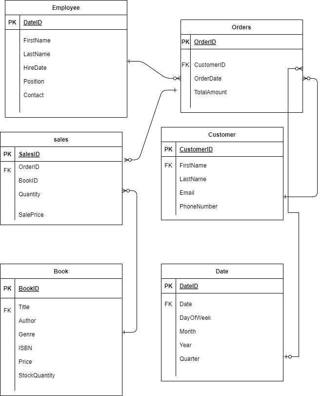
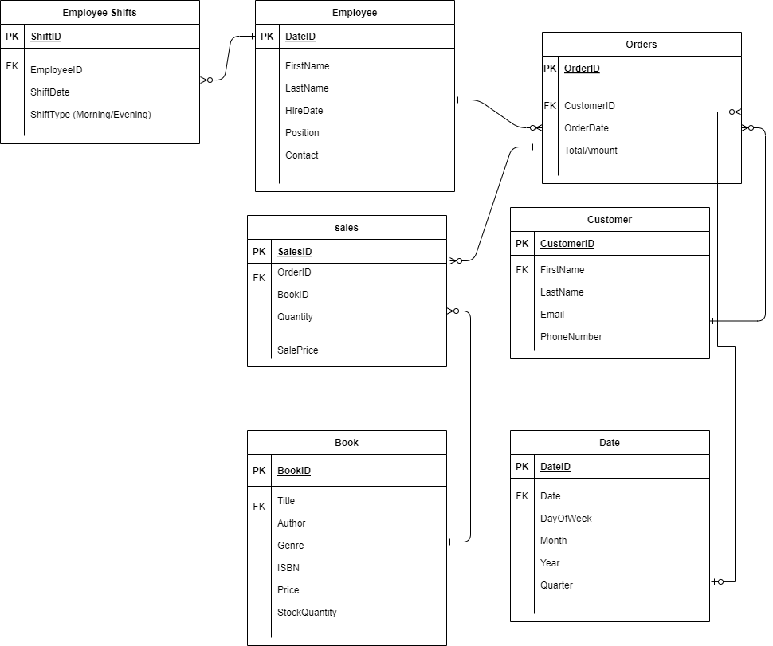

# Assignment 1: Design a Logical Model

## Question 1
Create a logical model for a small bookstore. 📚

At the minimum it should have employee, order, sales, customer, and book entities (tables). Determine sensible column and table design based on what you know about these concepts. Keep it simple, but work out sensible relationships to keep tables reasonably sized. Include a date table. There are several tools online you can use, I'd recommend [_Draw.io_](https://www.drawio.com/) or [_LucidChart_](https://www.lucidchart.com/pages/).


## Question 2
We want to create employee shifts, splitting up the day into morning and evening. Add this to the ERD.


## Question 3
The store wants to keep customer addresses. Propose two architectures for the CUSTOMER_ADDRESS table, one that will retain changes, and another that will overwrite. Which is type 1, which is type 2?

_Hint, search type 1 vs type 2 slowly changing dimensions._

Bonus: Are there privacy implications to this, why or why not?
```
Your answer...
```
Architecture 1 Type 1 : Overwrite Changes 
CustomerAddress (Overwrite)
CustomerID (FK), Address, City, State, ZipCode, Country
In this architecture, any update to the customer's address will overwrite the existing address.

Architecture 2 Type 2: Retain Changes 
CustomerAddress (Retain)
AddressID (PK), CustomerID (FK), Address, City, State, ZipCode, Country, StartDate, EndDate, IsCurrent
In this architecture, a new record is created for each address change. The IsCurrent column helps identify the current address.

Privacy Implications
Type 1 (Overwrite): Less privacy concern since historical data is not retained. However, previous address information is lost.
Type 2 (Retain): More privacy concern since historical address data is retained. Ensuring data security and compliance with privacy regulations is critical.


## Question 4
Review the AdventureWorks Schema [here](https://i.stack.imgur.com/LMu4W.gif)

Highlight at least two differences between it and your ERD. Would you change anything in yours?
```
Your answer...
```
Differences between AdventureWorks and my ERD:

Complexity and Granularity: The AdventureWorks schema is more complex, with more detailed tables and relationships, such as separating customer address and contact details into different tables. My ERD is simpler, combining customer details into fewer tables.
Product and Inventory Management: AdventureWorks includes detailed tables for product and inventory management, such as Product, ProductCategory, and Inventory. My ERD focuses more on the basic entities of a small bookstore without detailed inventory tracking.
Reflection:
To enhance my ERD, I could consider separating customer contact details and addresses into different tables for better data normalization and scalability. Additionally, adding more detailed inventory management could help in managing the stock more efficiently.


# Criteria

[Assignment Rubric](./assignment_rubric.md)

# Submission Information

🚨 **Please review our [Assignment Submission Guide](https://github.com/UofT-DSI/onboarding/blob/main/onboarding_documents/submissions.md)** 🚨 for detailed instructions on how to format, branch, and submit your work. Following these guidelines is crucial for your submissions to be evaluated correctly.

### Submission Parameters:
* Submission Due Date: `June 1, 2024`
* The branch name for your repo should be: `model-design`
* What to submit for this assignment:
    * This markdown (design_a_logical_model.md) should be populated.
    * Two Entity-Relationship Diagrams (preferably in a pdf, jpeg, png format).
* What the pull request link should look like for this assignment: `https://github.com/<your_github_username>/sql/pull/<pr_id>`
    * Open a private window in your browser. Copy and paste the link to your pull request into the address bar. Make sure you can see your pull request properly. This helps the technical facilitator and learning support staff review your submission easily.

Checklist:
- [ ] Create a branch called `model-design`.
- [ ] Ensure that the repository is public.
- [ ] Review [the PR description guidelines](https://github.com/UofT-DSI/onboarding/blob/main/onboarding_documents/submissions.md#guidelines-for-pull-request-descriptions) and adhere to them.
- [ ] Verify that the link is accessible in a private browser window.

If you encounter any difficulties or have questions, please don't hesitate to reach out to our team via our Slack at `#cohort-3-help`. Our Technical Facilitators and Learning Support staff are here to help you navigate any challenges.
